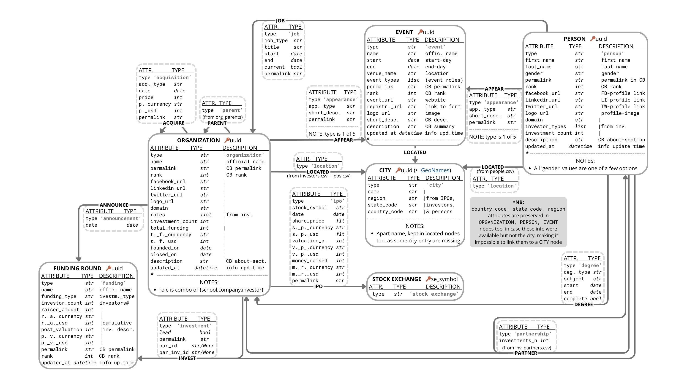
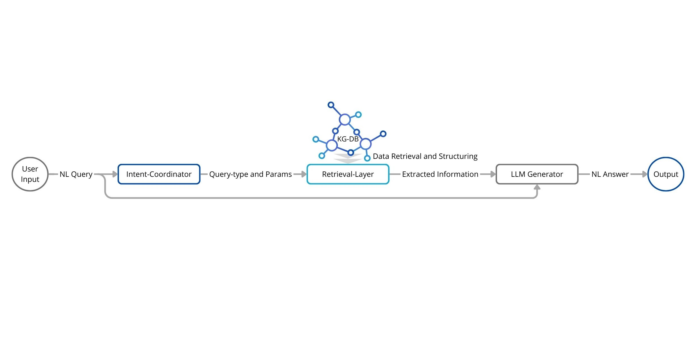

# Leveraging Knowledge-Graph representation for RAG-based copiloting in the VC context

<table>
<tr>
  <td align="center"><strong style="color:gray">Student</strong> Matteo Spadaccia</td>
  <td align="center"><strong style="color:gray">Supervisor</strong> Prof. Filippo Menolascina</td>
  <td align="center"><strong style="color:gray">Tutor</strong> Dr. Shadullah Sartaj Syed</td>
  <td align="center"><strong style="color:gray">Tutor</strong> Dr. Muhammad Zain Bin Aamir</td>
</tr>
</table>

## Abstract

In the increasingly competitive startup ecosystem, effective matchmaking between early-stage ventures and investors is critical for securing thoughtful funding and maximizing innovation potential. This project aspires to enhance the current systems that facilitate this combination process, by bolstering the navigability of the partnerships realm on the startups' side. Leveraging Artificial Intelligence (AI) and graph analysis, models with this aim represent historical funding patterns and the involved players' relationships, usually in a network-form able to capture the domain's interconnected nature.

Specifically, the present [study](KG_for_RAG_in_VC_context(no_appendix).pdf) is built upon the algorithmic framework of Doriot AI, an emerging company focused on supporting startups' fundraising journeys: experimenting a Knowledge-Graph (KG) representation of the Venture Capital (VC) context, as extrapolated by the firm's core DataBase (DB), the work aims at improving the performance of Doriot AI's Retrieval Augmented Generative (RAG) model for investment environment exploration. The ultimate goals are to convert the underlying information-set to a directly exploitable network format, developing a robust graph-embedding pipeline, and thus to lay the foundations for a higher-level Question-Answering (QA) system, while drawing the directions for future developments. In fact, the so-obtained KG-DB opens great and incremental possibilities to upgrade this service and the other Doriot AI's main one - a recommender model to uncover plausible funders - therefore pushing the boundaries of Machine Learning (ML) methods oriented to empowering startups with better copiloting tools, rather than to assisting investors' decision-making.

## Network DataBase design

The first objective is to enhance the model's accuracy and contextual reasoning by capturing rich relationships between entities and concepts that are not easily represented in flat SQL tables. Doriot AI's core DataBase is thus embedded into a Knowledge-Graph, directly accenting its inherent network-nature; once translated in this new format (see [schema](Visuals/NetworkDB.jpg) below), the current information could be further enriched by including all the remaining components of the company's data and interconnecting additional conceptual entities (e.g. industrial-field, theoretical-knowledge and inspiring-cause nodes, web-scraped or abstracted by present edges and attributes).

## RAG upgrade

The so-built network DataBase is experimented for data-extraction as the underlying knowledge-set for Doriot AI's Retrieval-Augmented-Generation model, attempting a thorough refinement of its capabilities by switching to a graph-based retrieval-layer (see [pipeline](Visuals/KG_RAG_scheme.jpg) below). The graph-based approach enables more intelligent traversals and relevance scoring, improving both the retrieval quality and the exactness of the generated responses.

## Results

In conclusion, based on the time-records computed through a RAG evaluation script and an LLM-assisted annotation of the corresponding test-cases data-extraction and response outputs, a complete evaluation table (see the related [visuals](Visuals/)) is composed to summarize the obtained shift in holistic performance between the previous retrieval-layer and the upgraded one. The new model reaches a significantly higher answers' quality, despite requiring longer processing with respect to its original counterpart. A complete report for the project and its impact can be found in the related [thesis paper](KG_for_RAG_in_VC_context(no_appendix).pdf).

> [!NOTE]
>
> The complete version of the code is not public, as property of Doriot AI; here the full final paper is available, with no appendices, which contained code snippets and significant data parts.